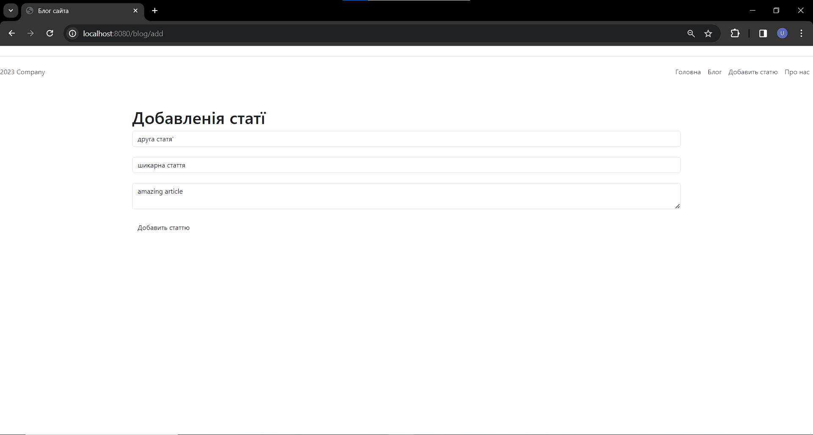
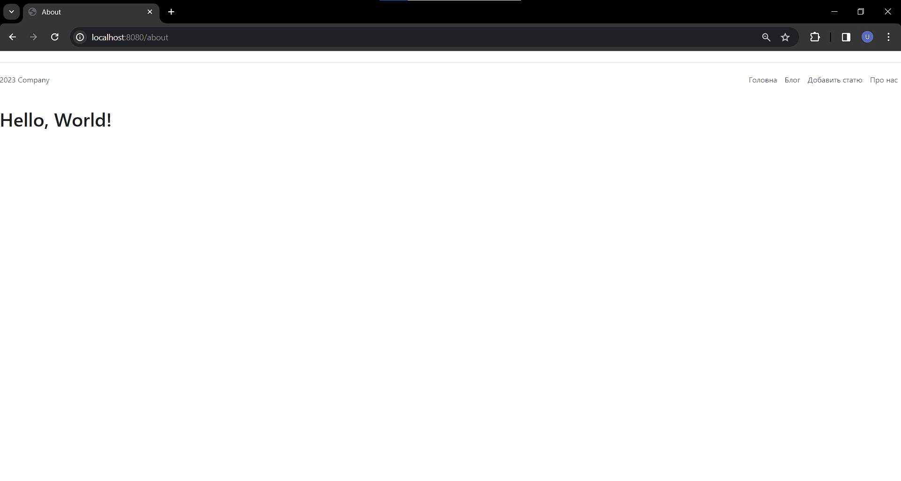

<h1>SpringBlog</h1>
<h2>Description</h2> 
This program was crated for education purposes.  This is a website with 
with the ability to add, view, edit, delete articles. 
Connection to the mySQL database is established using Spring 
the CrudRepository interface is created by the Open Server application  
Home page: 
Blog: 
Add an article: 
View article: 
About us page: 
